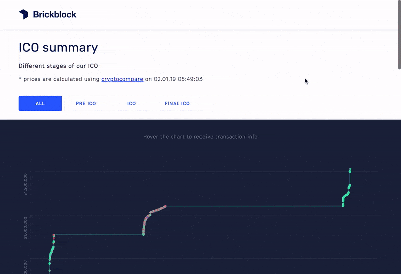

# React Blockchain Ico



This is an example of a decoupled frontend app implemented with `React` and `Redux`, fetching data from multiple rest api endpoints

- You can find a [online demo here](https://inputs.now.sh/)

## :gear: Configuration

Modify configuration in `.env` (start by renaming `env.example` to `.env`, [wondering why?](https://codeburst.io/process-env-what-it-is-and-why-when-how-to-use-it-effectively-505d0b2831e7))


## :rocket: Getting started

After you have cloned the repository to your computer please run the following commands inside the project folder:

```bash
# install dependencies
yarn

# run the app (localhost:8080)
yarn start
```

## :construction: Test

To make sure the application works as expected you can run the test suite like this:

```bash
# runs all test files
yarn test

# with coverage report
yarn test --coverage

# watch
yarn test --watch

# run tests that match a spec-name (e.g `App` or `components/Form`)
yarn test name-of-spec

# update snapshots that are out of date
yarn test --updateSnapshot
```

> A full list of `jest` cli commands can be found [here](https://jestjs.io/docs/en/cli)

## :link: Redux Structure

You will find the `Redux` configuration in `src/store/index`

The redux store is organized in feature based modules, each module brings it's own actions and reducers

**Current modules:**
- `src/containers/App`
- `src/containers/Transactions`

> **Info:** More about different ways to structure your `Redux` project [here](https://redux.js.org/faq/code-structure)

## :link: Api's

This app uses multiple api endpoints to receive data
- Transactions
  - https://blockchain.brickblock.io/inputs or http://localhost:5000/db
- Transactions meta
  - https://bb-data.now.sh
- Crypto currency exchange rates
  - https://min-api.cryptocompare.com

```bash
# serve main data from local server (localhost:5000)
# you will need to set `isLocal` to true inside `src/Transactions/getTransactions.jsx`
yarn server 
```

## :rainbow: Prettier

Prettier is a code formatter that ensures that all outputted code conforms to a consistent style

Run the following command before each commit to make sure your changes are valid :nerd_face:

Formats all `Js/Jsx` files according to `prettier.config.js` presets

```bash
# format all files
yarn format
```

## :vertical_traffic_light: Linter

> 
> Code linting can be seen, in a more broad sense, as static code analysis.
> 
> [What's the difference between Lint and Prettier?](https://restishistory.net/blog/whats-the-difference-between-eslint-and-prettier.html)

Lints all `Js/Jsx` files according to `.eslintrc` presets

```bash
# lint all files
yarn lint
```

> **Note:** Before running `yarn lint`, please run `yarn format` first :wink:

## :factory: Build

If you wish to host this app, you will need to run the build command. After you've run the command, you will find the build artefacts in the `/dist` folder.

```bash
# build static files
yarn build
```

## :truck: Deploy to Zeit.co with `now`

If you wish, you can deploy this app to Zeit.co. To do so please configure the following settings before you hit `yarn deploy` 

> Info: It's also possible to host with any other providers (e.g. Heroku) which support `node.js` but you'll need to configure them on your own :cry:

1. Modify configuration in `.env` (start by renaming `env.example` to `.env`, [wondering why?](https://codeburst.io/process-env-what-it-is-and-why-when-how-to-use-it-effectively-505d0b2831e7))
2. Modify configuration in `now.json` (start by renaming `now.example.json` to `now.json`
3. Deploy!

> Info: `Zeit.co now` creates deployments with random url names. In order to properly configure `cors` it is recommended to create an `alias` for your domain. 
> 
> It's easy to do with the following command after deployment:
> 
> ```bash
> now alias {the-random-deployment-url} {alias-name}

Finally now you're ready to:

```bash
# deploy app to production
yarn deploy
```
> Info: This will run `format` and `lint` in the `prebuild` step, to make sure the deployed version is meeting the requirements.
>
> If you want to skip this step, you can remove the flag from the `prebuild` in `package.json/scripts`

## :green_book: Tools, Libraries and Packages

### React

A JavaScript library for building user interfaces

More info [here](https://reactjs.org/)

##### Additional Packages
- [React Dom](https://reactjs.org/docs/react-dom.html)
  - The react-dom package provides DOM-specific methods that can be used at the top level of your app and as an escape hatch to get outside of the React model if you need to. Most of your components should not need to use this module.

### Babel, Lint & Prettier

This application follows the [airbnb](https://github.com/airbnb/javascript) coding styleguide conventions for `ECMAScript 2018` setup with [webpack 3](https://webpack.js.org/), [babel 7](https://github.com/babel/babel), [eslint](https://eslint.org/) and [prettier](https://github.com/prettier/prettier).

### Axios

Promise based HTTP client for the browser and node.js

More info [here](https://lodash.com/)

### Dotenv

Loads environment variables from `.env` file 

More info [here](https://github.com/motdotla/dotenv)

### Moment

Parse, validate, manipulate, and display dates and times in JavaScript

More info [here](https://momentjs.com/)

### Polished

A lightweight toolset for writing styles in JavaScript

More info [here](https://polished.js.org/)

### React Redux

Official React bindings for Redux

More info [here](https://github.com/reduxjs/react-redux)

### Redux

A predictable state container for JavaScript apps

More info [here](https://redux.js.org/)

### Redux Thunk

Async middleware for Redux

More info [here](https://github.com/reduxjs/redux-thunk)

### Semiotic

A data visualization framework combining React & D3

More info [here](https://github.com/emeeks/semiotic)

### Styled Components

Visual primitives for the component age. Use the best bits of ES6 and CSS to style your apps without stress 

More info [here](https://www.styled-components.com/)

## Testing

### Enzyme

Enzyme is a JavaScript Testing utility for React that makes it easier to assert, manipulate, and traverse your React Components' output

More info [here](https://airbnb.io/enzyme/)

### Jest

Delightful JavaScript Testing

More info [here](https://jestjs.io/)

### Jest Enzyme

Jest assertions for enzyme

More info [here](https://github.com/FormidableLabs/enzyme-matchers)

### Jest Styled Components

Jest utilities for Styled Components 

> **Info:** currently throws warning for styled-components ^4.0.0 but seems to work fine :smile: `jest-styled-components@6.3.1" has incorrect peer dependency "styled-components@^2.0.0 || ^3.0.2"`

More info [here](https://github.com/styled-components/jest-styled-components)

### React Test Renderer

This package provides a React renderer that can be used to render React components to pure JavaScript objects, without depending on the DOM or a native mobile environment

More info [here](https://reactjs.org/docs/test-renderer.html)

### Redux Mock Store

A mock store for testing Redux async action creators and middleware

More info [here](https://github.com/dmitry-zaets/redux-mock-store)